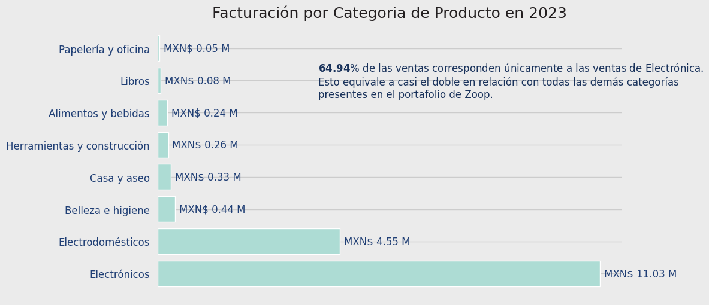
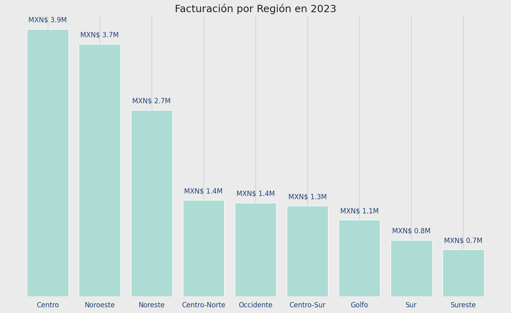
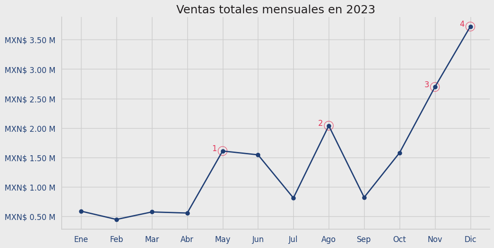
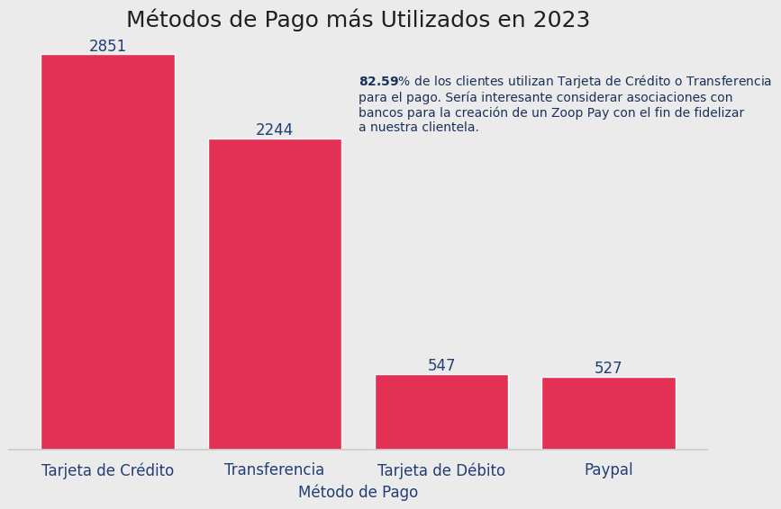
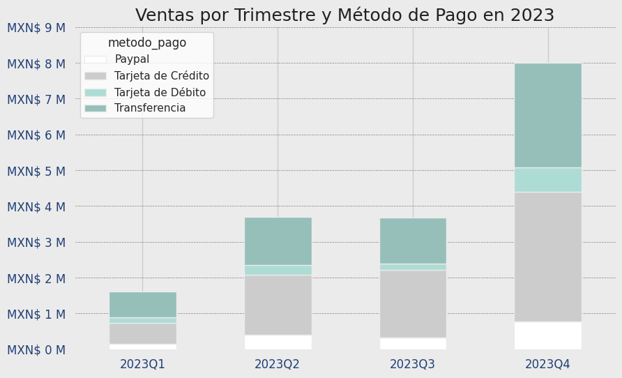
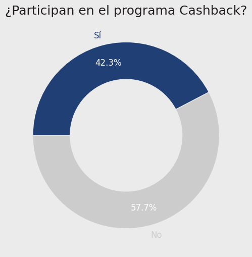
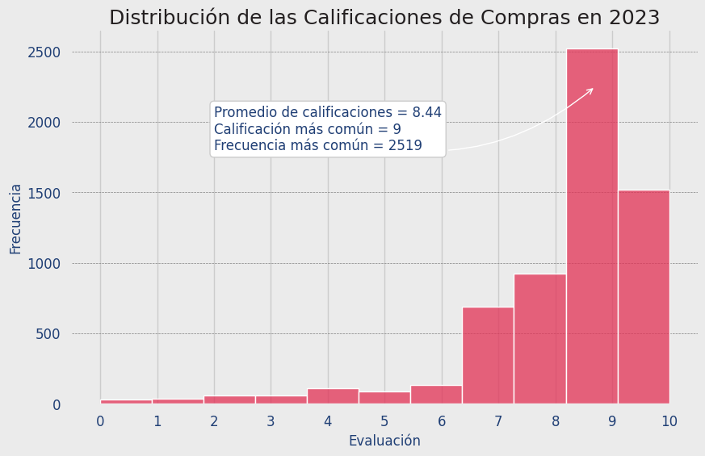
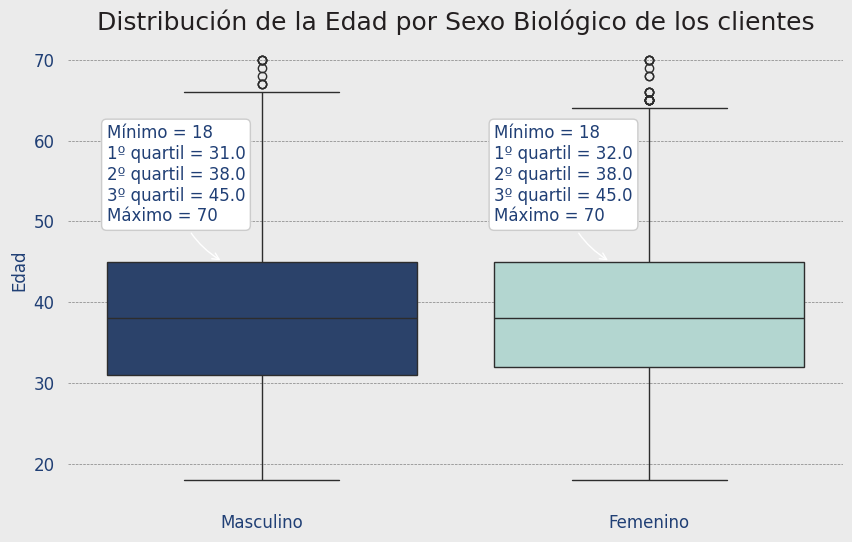

# 🧾 Informe de Ventas y Perfil de Clientes de Zoop 2023

## 📌 Introducción y Objetivos del Informe

Este informe tiene como objetivo analizar el comportamiento de ventas y el perfil de los(as) clientes de **Zoop durante el año 2023**, con el fin de identificar patrones de consumo, oportunidades de mejora en la estrategia comercial y posibles líneas de acción para fidelizar a la clientela y mejorar la experiencia de compra.

---

## 1. Visión General de las Ventas por Categoría

La categoría **Electrónicos representa el 64.94% de la facturación total**, seguida por **Electrodomésticos**. Esto sugiere que Zoop se posiciona fuertemente como una tienda de tecnología. Este posicionamiento puede aprovecharse para **fortalecer alianzas estratégicas** y campañas dirigidas a un público interesado en productos tecnológicos.

---

## 2. Visión General de las Ventas por Región en 2023

Las regiones **Centro (MXN$ 3.9M)** y **Noroeste (MXN$ 3.7M)** lideran en facturación, seguidas por el Noreste. Estas tres regiones concentran una parte significativa del total de ventas anuales. Esto sugiere una **alta penetración de mercado en zonas urbanas y desarrolladas**. Por otro lado, regiones como el **Sureste, Sur y Golfo** presentan oportunidades de crecimiento mediante estrategias focalizadas de marketing, alianzas locales o expansión logística.

---

## 3. Tendencia de las Ventas a lo Largo de los Meses en 2023

Se observa una **tendencia de crecimiento progresiva**, con picos destacados en **mayo, agosto, noviembre y diciembre**. Esto puede estar relacionado con campañas promocionales, estacionalidad o eventos comerciales como el Buen Fin. Se recomienda **reforzar las campañas** en los meses con menor desempeño como febrero y julio.

---

## 4. Métodos de Pago Más Utilizados

El análisis muestra un **alto nivel de bancarización de los clientes**, con un uso predominante de **Tarjetas de Crédito y Transferencias**. Esto abre la puerta a establecer alianzas estratégicas con bancos para fortalecer **Zoop Pay** y ofrecer **nuevas opciones de financiación**.

---

## 5. Ventas Trimestrales vs. Método de Pago

Se observa un **crecimiento claro trimestre a trimestre**, con un pico en el cuarto trimestre del año. Los métodos de pago más usados continúan siendo **Transferencia y Tarjeta de Crédito**, lo cual refuerza la importancia de integrar **servicios financieros más avanzados** en la plataforma.

---

## 6. Programa de Cashback y Zoop Pay

- **42.3%** Participan activamente en el programa de Cashback  
- **57.7%** No participan: oportunidad de crecimiento

Existe una oportunidad importante de **promover este beneficio** mediante campañas informativas que fomenten su uso y, a su vez, **ayuden a fidelizar a los usuarios y maximizar el valor de Zoop Pay**.

---

## 7. Evaluación de los Productos

- **8.44** Calificación promedio  
- **9** Calificación más frecuente  
- **2500+** Evaluaciones altas

Esto refleja una **alta satisfacción del cliente**, lo cual es una fortaleza clave para incentivar **programas de referidos**, testimonios y consolidar la reputación de Zoop.

---

## 8. Segmentación de Clientes

La mayoría de los(as) clientes tienen entre **31 y 45 años**, con una **participación equilibrada entre hombres y mujeres**. Este perfil puede guiar las estrategias de comunicación, campañas publicitarias y selección de productos más adecuados para este segmento generacional.

---

## ✅ Conclusiones Clave

- Zoop se destaca como **líder en la venta de productos electrónicos**.
- Las ventas muestran un **crecimiento constante**, con picos en los últimos meses del año.
- Predomina el uso de **Tarjeta de Crédito y Transferencia**, lo cual refleja **confianza en medios digitales**.
- Se identifican **oportunidades de mejora en la adopción del programa Cashback y Zoop Pay**.
- La **satisfacción del cliente es elevada**, ideal para fidelización y marketing relacional.
- El público objetivo es un **adulto joven entre 31 y 45 años**, fundamental para definir estrategia comercial.
